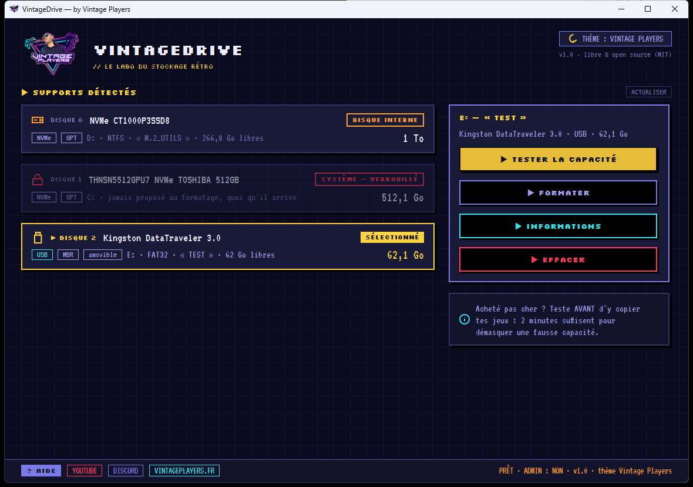

# VintageDrive

**Le labo du stockage rétro — par [Vintage Players](https://vintageplayers.fr/).**

Teste la vraie capacité de tes clés USB, cartes SD et disques, puis formate-les aux
petits oignons pour ta console — FAT32 sans la limite des 32 Go, presets Wii, PS2,
GDEMU et 25 autres, pédagogie intégrée. Libre, open source, sans installation.



## Pourquoi ?

- **Les capacités falsifiées.** Le « SSD 1 To à 15 € » qui est en réalité une puce de
  32 Go maquillée : VintageDrive le démasque en quelques minutes (test rapide
  échantillonné) ou le prouve octet par octet (test complet).
- **Le FAT32 au-delà de 32 Go.** Windows refuse ; les consoles l'exigent. VintageDrive
  formate en FAT32 jusqu'à 2 To, clusters au choix, partition MBR alignée — avec un
  formateur maison réécrit depuis la spécification Microsoft.
- **Les bons réglages sans réfléchir.** 28 presets consoles (Wii, GameCube, PS1/PSIO,
  Saturn, Dreamcast/GDEMU, Neo Geo…) avec, pour chacun, l'explication du *pourquoi*.

## Fonctionnalités

| | |
|---|---|
| 🕵️ Test de capacité réelle | rapide (~2 min, auto-calibré) ou complet (100 % de la surface) |
| 🧾 Preuve exportable | l'écran « GAME OVER » s'enregistre en PNG, à partager sur les forums |
| 💾 Formatage universel | FAT32 (sans limite 32 Go), exFAT, NTFS · clusters 4-64 Ko · MBR |
| 🎮 Presets consoles | 28 profils avec fiches pédagogiques intégrées |
| 🔍 Informations | table de partitions complète, série, firmware, occupation, Go vs Gio |
| 🧹 Effacements | nettoyage rapide (débloque les supports récalcitrants) et zéros sur 100 % |
| 🎨 Thèmes | thème Vintage Players par défaut + thèmes communautaires `.vdtheme` |
| 🔒 Garde-fous | disque système verrouillé, avertissement disques internes, double confirmation |

## Téléchargement

Dernière version : voir les **[Releases](../../releases)** — un zip, aucun installateur,
aucune dépendance (Windows 10/11 ; Windows 7 SP1 avec .NET Framework 4.8).

## Compiler soi-même

SDK .NET requis. Le binaire produit cible .NET Framework 4.8 (préinstallé sur Windows 10/11).

```
dotnet build src/VintageDrive.App -c Release
```

L'application est dans `src/VintageDrive.App/bin/Release/net48/`. Une CLI de développement
(`src/VintageDrive.Cli`) expose le moteur en ligne de commande : `list`, `info`, `probe`,
`fulltest`, `format`, `clean`, `wipe`, `presets`.

## Licence

MIT — voir [LICENSE](LICENSE). Le formateur FAT32 est une implémentation originale
d'après la spécification Microsoft (aucun code repris de fat32format / guiformat).
Polices embarquées : Silkscreen et VT323, licence SIL OFL (voir `src/VintageDrive.App/Assets/Fonts/`).

## Communauté

- YouTube : [@vintageplayerss](https://www.youtube.com/@vintageplayerss)
- Discord : [rejoindre](https://discord.gg/d68NjkPRMz)
- Site : [vintageplayers.fr](https://vintageplayers.fr/)
